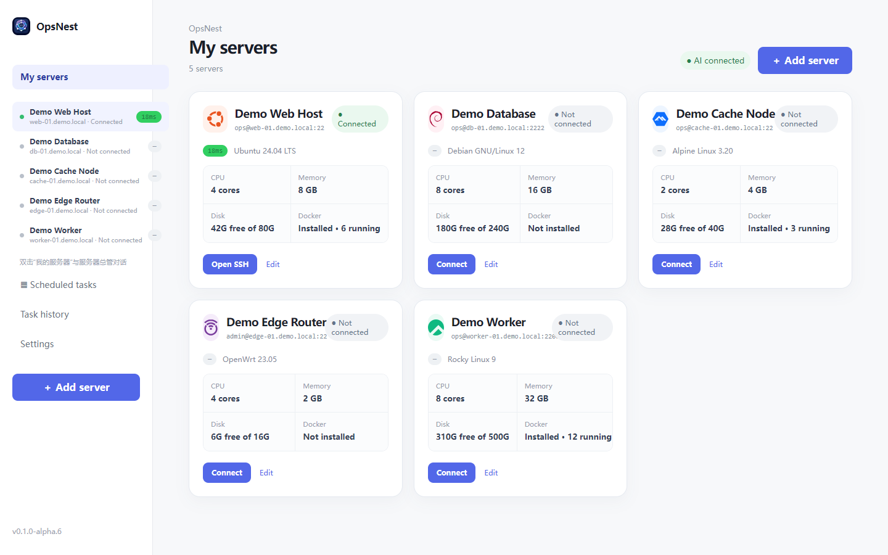
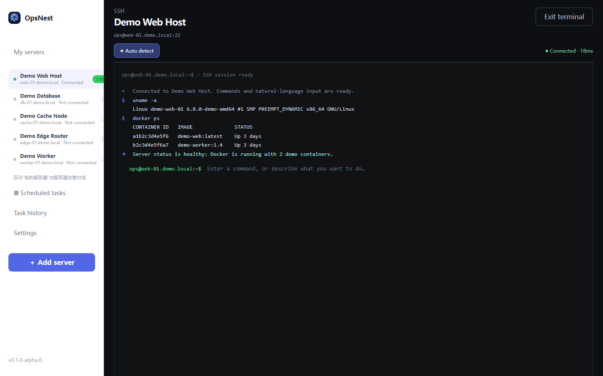

# OpsNest

[简体中文](README.md) · English

A local-first SSH server manager for beginners, with a built-in AI Agent.

Users only need a server address, a login method, and a model endpoint. OpsNest keeps a real SSH terminal while adding server dashboards, service shortcuts, and natural-language AgentRun workflows. It does not require an OpsNest cloud service or a separate deployment.

> Connect to a server, describe what you need, and understand every step.





The screenshots use fictional demo servers and contain no private infrastructure data.

## Current status

Current version: `0.1.0-alpha.8`

OpsNest is still Alpha software intended for real-environment testing, feedback, and collaborative development. The current validation targets are Windows x64 clients and Debian, Ubuntu, OpenWrt/iStoreOS, and NAS-like Linux systems. It is not a production bastion host and does not claim complete coverage of every distribution, package manager, or vendor system.

## What is implemented

### Servers and desktop experience

- Save multiple servers with IP addresses, domains, and custom SSH ports
- Password and SSH private-key login
- Store server credentials and AI API keys in the operating-system credential store
- Show connection status, latency, operating system, CPU, memory, system disk, and Docker information
- Dedicated detail views for ordinary Linux, OpenWrt/iStoreOS, and NAS servers
- Discover common web panels, Docker containers, and reachable ports
- Add custom browser shortcuts
- Chinese interface with English available

### Native SSH terminal

- Command-line-style persistent SSH Shell sessions
- Preserve `cd`, environment variables, virtual environments, and interactive terminal programs
- Execute normal Shell commands directly
- Type `stop` to stop a running command
- Keep server-manager and child-server sessions independent
- Restore sessions, commands, and raw server output after restarting the app

### AI AgentRun

Natural-language tasks move through a local AgentRun flow:

```text
Understand the request
  → Read server memory and context
  → Search the web when needed
  → Explore the server
  → Run read-only diagnosis
  → Build the next plan
  → Ask for approval
  → Execute
  → Verify the result
  → Summarize in plain language
  → Update server memory
```

The Agent receives the machine identity, system type, discovered services, and relevant task history. It keeps raw command output visible while explaining the result. After a failed command it can continue analysis and make a limited recovery plan instead of retrying forever.

Settings provide three intervention modes:

1. **Smart AI intervention** (default): clear Shell commands execute directly; natural-language requests go to the Agent; unavailable AI falls back automatically.
2. **AI always involved**: commands and natural language are interpreted by the model first.
3. **AI not involved**: classic SSH behavior; input is sent directly to the remote Shell.

### Server manager, Cron, and logs

- Use the server manager for multi-server conversations and maintenance planning
- Add or remove local server records through the manager conversation
- Cron jobs run on the target server; OpsNest reads, displays, and manages them over SSH
- Keep task history, runtime logs, AI conversation logs, and terminal sessions locally
- Use server memory as context for later Agent conversations; it does not replace user approval

## AI models

OpsNest supports OpenAI-compatible endpoints and presets for OpenAI, DeepSeek, OpenRouter, Ollama, and custom endpoints. You choose the model provider. Server command output, log fragments, or configuration content may be sent as context to that provider.

Recommended to try: [FreeLLMAPI](https://github.com/tashfeenahmed/freellmapi). It provides an OpenAI-compatible endpoint that aggregates multiple free model providers and supports custom OpenAI-compatible endpoints. It is an independent third-party project; read its documentation, license, and terms before use.

## Local data and security boundary

- OpsNest does not require an OpsNest cloud service; primary data stays on the local computer
- Server passwords, private-key passphrases, private-key paths, and AI API keys use the operating-system credential store; private-key files remain at the user-selected location
- Server lists, model URLs, interface settings, and task summaries are stored in local application data
- Runtime logs and AI/terminal conversation logs are stored locally as JSONL files
- OpsNest does not send credentials to the model; server output may still be sent to the model API you configure

Alpha limitations remain: first-time SSH connections use trust on first use and do not yet show a fingerprint confirmation dialog; the Agent can still generate Shell commands. Use test servers or backed-up environments, verify new host fingerprints through another trusted channel, and remove passwords, API keys, tokens, cookies, domains, and private addresses before sharing logs, screenshots, or Issues.

See [SECURITY.md](SECURITY.md) for the pre-release security review.

## Getting started

### Use a Windows build

Download `OpsNest_*_x64-setup.exe` and launch it after installation:

1. Open Settings and configure a model API (AI can remain unconfigured)
2. Add your first SSH server
3. Connect from My Servers
4. Double-click a server name to open the native SSH terminal
5. Double-click My Servers to open the server manager

### Develop from source

Requirements: Node.js 18+, the Rust stable toolchain, and Tauri 2 platform dependencies.

```bash
npm install
npm run check
npm run dev
npm run tauri:dev
npm run build
npm run tauri:build
```

Installer output: `src-tauri/target/release/bundle/nsis/`

## Project structure

The React interface and AgentRun flow live in `src/main.tsx`. SSH, model calls, web search, local storage, logs, and credentials are implemented under `src-tauri/src/`. Architecture notes, roadmap, and fictional demo screenshots are under `docs/`.

## Versioning

- `0.1.0-alpha.N`: early testing, small fixes, and experimental features
- `0.1.0-beta.N`: more complete public testing
- `0.1.0`: stable release

Before each release, check `package.json`, `src-tauri/Cargo.toml`, `src-tauri/tauri.conf.json`, the backend version command, and the version shown in the UI.

## Roadmap

Near-term work includes server file management, quick installation actions, SSH tunnels, more system-specific home pages, and a richer Agent tool layer. See [docs/roadmap.md](docs/roadmap.md).

## Open source and third-party notices

See [THIRD_PARTY_NOTICES.md](THIRD_PARTY_NOTICES.md) for dependency and icon attribution.

Real-environment feedback and improvements are welcome. Read [SECURITY.md](SECURITY.md) first, and never publish credentials or unredacted server logs in an Issue.
