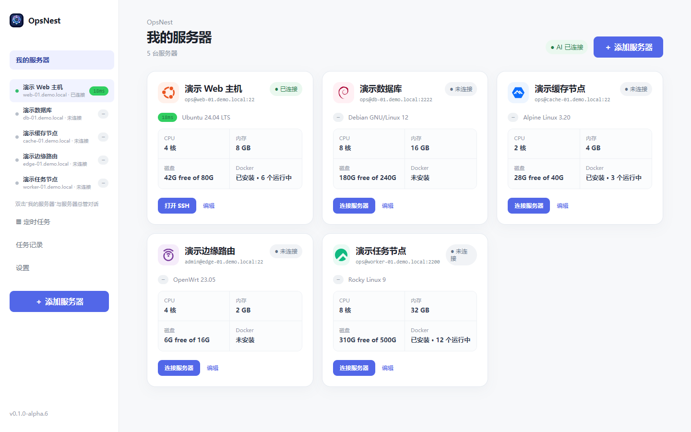
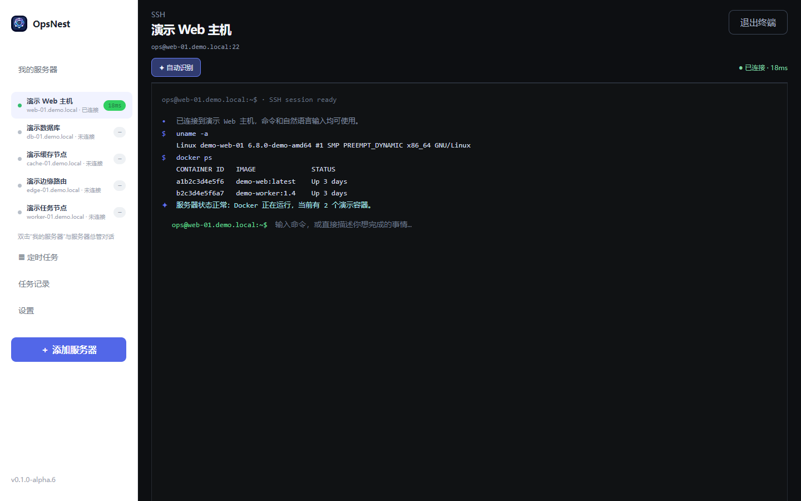

# OpsNest

简体中文 · [English](README.en.md)

一款面向新手、内置 AI Agent 的服务器 SSH 管理软件。

用户只需要对服务器有基本认知，添加自己的服务器地址和登录信息，再配置一个模型接口，即可开始管理自己的服务器和服务器集群。无需编程基础，甚至无需记住任何命令行。

OpsNest 的开发目标，是做成一款功能强大但非常易用的服务器管理软件：把 SSH、服务器状态、文件与任务管理，以及 AI Agent 整合到一个清晰易懂的桌面应用中。

> 连接你的服务器，用人话描述需求，OpsNest 帮你完成剩下的工作。





OpsNest 目前处于 Alpha 阶段，正在从早期架构原型逐步进入可实际使用的半成品阶段。它支持保存多台 SSH 服务器，在本地运行 AgentRun，并把传统终端和自然语言操作放在同一个桌面应用中。

## 当前版本

`0.1.0-alpha.6`

当前主要验证平台：

- Windows x64
- Linux 服务器：已重点验证 Debian / Ubuntu
- SSH：密码登录、私钥登录、IP 地址和域名
- 模型：OpenAI 兼容 API、DeepSeek、OpenAI、OpenRouter、Ollama 等

这是 Alpha 版本，适合测试和反馈，不建议直接用于没有备份的生产环境。

## 已实现功能

### 服务器管理

- 保存多台 SSH 服务器
- 支持 IP 地址和域名
- 支持自定义 SSH 端口
- 支持密码和 SSH 私钥
- 显示连接状态、系统信息和延迟
- 服务器列表、编辑、连接、删除
- 服务器密码/私钥凭据保存在本机系统安全存储中

### 终端会话

- 命令行风格的 SSH 会话窗口
- 可直接输入普通 Shell 命令
- 支持 `stop` 停止正在执行的命令
- 子服务器会话与服务器总管会话相互独立
- 会话记录重启后可以恢复
- 完整保留命令和服务器原始输出

### AI AgentRun

自然语言请求会经过本地 AgentRun 流程：

```text
理解请求
  → 读取服务器记忆
  → 联网搜索（需要时）
  → 探索服务器环境
  → 只读诊断
  → 生成下一步命令
  → 用户批准
  → 执行
  → 验证结果
  → AI 总结
  → 更新服务器记忆
```

当前 Agent 已支持：

- 命令执行失败后继续分析，而不是立即结束
- 检测 `command not found`、路径不存在等常见错误
- 最多进行有限次数的恢复规划，避免无限重试
- 不重复执行上一条失败命令
- 把完整原始输出留在终端中
- 另外生成适合新手阅读的自然语言总结
- 将任务结果保存为服务器记忆，供后续对话参考

### 服务器总管

总管是面向多台服务器的普通聊天窗口，可以：

- 同时查看多台已保存服务器
- 规划跨服务器的检查和维护任务
- 连接所有服务器
- 直接通过对话添加服务器
- 直接通过对话删除本地服务器记录和凭据

例如：

```text
添加服务器
名称：腾讯云
地址：tc.example.com
端口：22
用户名：root
密码：******
```

总管会测试连接，保存凭据，读取基础系统信息，并把服务器加入列表。删除服务器只会删除 OpsNest 本地保存的记录和凭据，不会删除远程机器。

### AI 介入模式

设置中提供三种模式：

1. **AI 智能介入**（默认）
   - 识别为普通 Shell 命令时直接执行
   - 自然语言请求交给 Agent
   - AI 不可用时自动降级
2. **AI 全程介入**
   - 命令和自然语言都会先由 AI 理解
   - 更适合本地模型
3. **AI 全程不介入**
   - 相当于传统 SSH 管理软件
   - 所有输入直接作为 Shell 命令执行

## 本地数据与安全边界

OpsNest 不要求部署云端服务，主要数据保存在用户电脑上：

- 服务器和模型配置：本地应用数据文件
- SSH 凭据：操作系统凭据存储
- 软件运行日志：`opsnest-runtime.jsonl`
- AI 与终端对话记录：`opsnest-conversations.jsonl`

模型 API 由用户自行配置。服务器命令输出可能会作为上下文发送给用户选择的模型服务，因此不要把不应离开本机的敏感日志交给云端模型。OpsNest 会做基础脱敏，但 Alpha 版本不能保证识别所有密钥、Token 或密码格式。

当前安全策略包括：

- 高风险命令拦截
- 写操作需要用户批准
- 执行前尽量先做只读检查
- 服务器目标范围锁定
- 命令执行、结果和 AgentRun 写入本地日志
- 命令失败后限制自动恢复次数

当前 Agent 仍然会生成 Shell 命令。未来会继续把常用操作收敛为参数受限的工具，而不是让模型直接决定任意命令。

## 开始使用

### 直接使用打包版本

Windows 用户下载 `OpsNest_*_x64-setup.exe`，安装后启动应用即可。

首次使用：

1. 打开“设置”，配置模型 API
2. 添加第一台 SSH 服务器
3. 在“我的服务器”中连接服务器
4. 双击服务器名称进入终端
5. 双击“我的服务器”进入服务器总管

### 从源码开发

环境要求：

- Node.js 18+
- Rust stable toolchain
- Tauri 2 所需的平台依赖

安装依赖：

```bash
npm install
```

启动前端开发服务器：

```bash
npm run dev
```

启动 Tauri 桌面开发模式：

```bash
npm run tauri:dev
```

检查 TypeScript：

```bash
npm run check
```

构建前端：

```bash
npm run build
```

构建 Windows 安装包：

```bash
npm run tauri:build
```

安装包输出目录：

```text
src-tauri/target/release/bundle/nsis/
```

## 目录结构

```text
src/
  main.tsx          React 界面、服务器管理和 AgentRun 流程
  styles.css        主界面与终端样式
  manager.css       总管与任务记录样式
src-tauri/
  src/
    lib.rs          Tauri 命令注册
    ssh.rs          SSH 连接、探测和命令执行
    ai.rs           模型 API 调用
    web.rs          联网搜索
    storage.rs      本地数据、日志和凭据存取
docs/
  architecture.md  架构说明
  roadmap.md        开发路线图
public/
  opsnest-icon.png  应用图标
```

## 版本规则

项目采用标准三段式版本号：

- `0.1.0-alpha.N`：早期测试、小修和实验功能
- `0.1.0-beta.N`：功能相对完整的公开测试阶段
- `0.1.0`：稳定版本

每次打包都应同步更新 `package.json`、`src-tauri/Cargo.toml`、`src-tauri/tauri.conf.json` 和界面显示版本。

## 当前限制与后续方向

- 目前主要面向 Windows x64，macOS、Linux、Android 和 iOS 尚未完成
- 不同 Linux 发行版的命令、包管理器和权限模型仍需继续适配
- Agent 的结果总结和恢复规划仍依赖用户配置的模型
- 联网搜索目前用于辅助判断，尚未覆盖所有软件的官方版本渠道
- 回滚、备份、批量变更和更细粒度的工具权限仍在完善
- 暂无云端同步和团队协作功能

详细开发计划见 [docs/roadmap.md](docs/roadmap.md)，下一阶段重点是服务器文件管理和服务器卡片快捷安装。

欢迎通过 GitHub Issue 提交真实服务器环境、错误日志和改进建议。提交日志或截图前，请先删除密码、API Key、Token、Cookie 和私有地址。

## 设计目标

OpsNest 的目标不是再做一个隐藏了命令行的聊天框，而是让用户能够：

```text
描述问题
  → 看懂 Agent 正在做什么
  → 查看真实命令和结果
  → 批准需要批准的动作
  → 获得人话总结
  → 下次继续使用熟悉的服务器记忆
```
