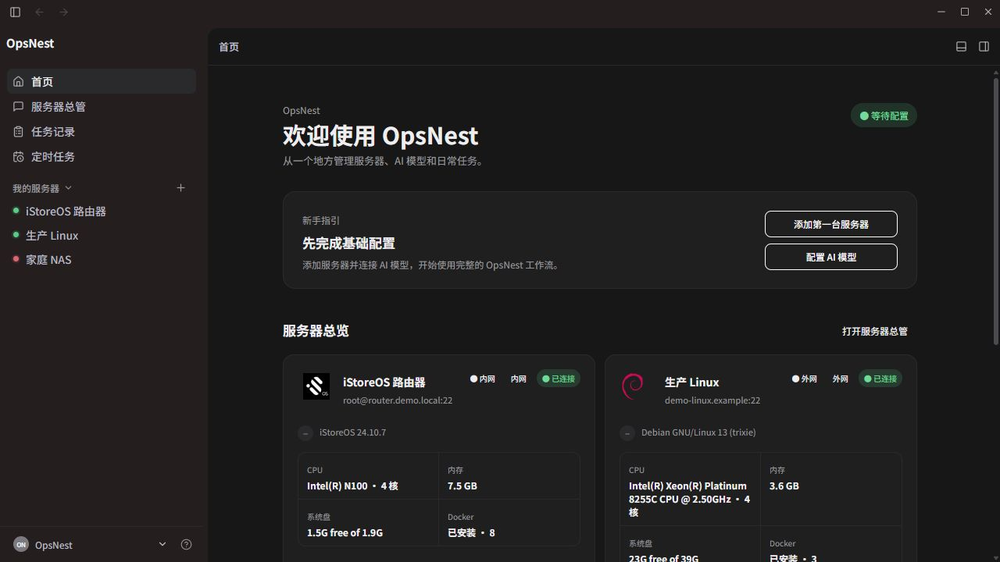
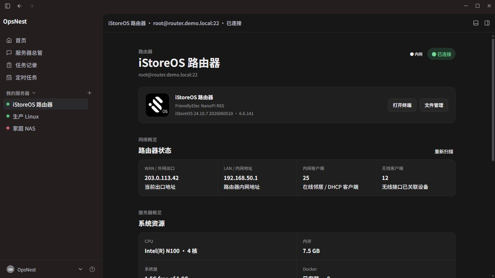
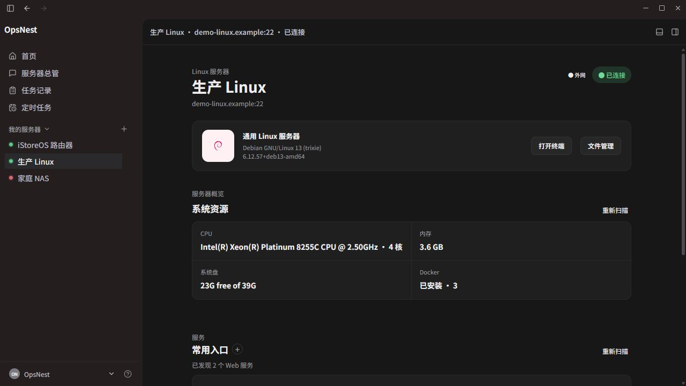
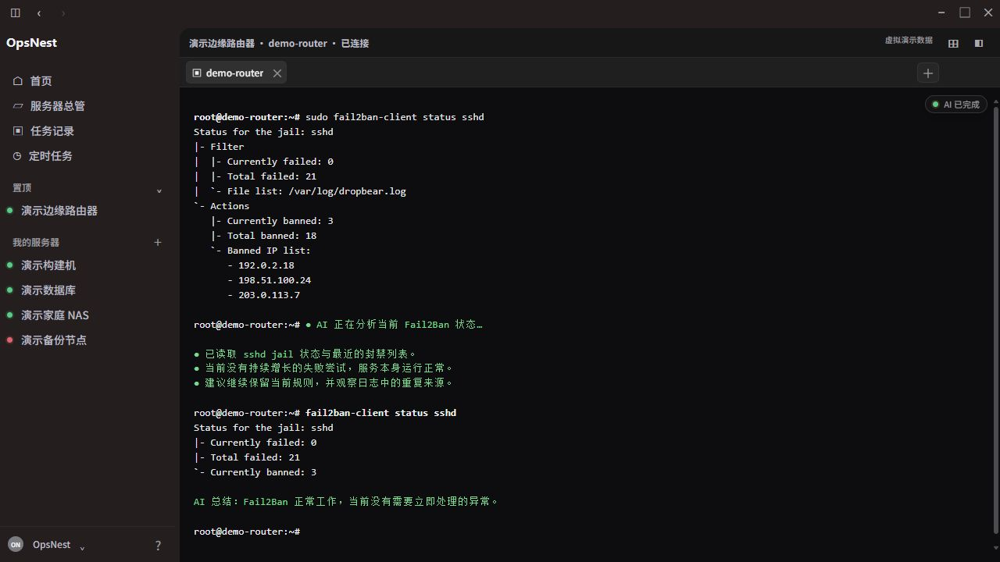

# OpsNest 运维小窝

简体中文 · [English](README.md)

## OpsNest 是款什么软件？

OpsNest，顾名思义，就是运维小窝。它是一款用于集中管理您拥有的终端设备（服务器、路由器、NAS 等）的管理软件。

## 虚拟演示截图

以下截图使用虚构的演示服务器和地址，仅用于展示界面，不包含真实服务器信息。

## 核心功能

- 强大的 AI-SSH 功能：将 AI 与 SSH 终端结合。您不必记忆复杂的命令行，只需要用自然语言描述需求，AI 就会自动帮您完成工作。
- 集成的 AI 是真正的 Agent，可以帮您分析、执行并总结报告，而不是只提供建议的辅助型顾问。
- 界面保持 SSH 原生状态，依然是熟悉的终端体验。

## 特色功能

1. **服务器大管家**：传统 AI 聊天界面，可以管理所有服务器。它可以修改软件界面，帮助您增加或删除服务器连接，也可以执行其他 Agent 命令。
2. **特色首页**：每台终端连接的首页都会根据当前终端能力，自动识别为普通 Linux 服务器、OpenWrt 路由器或 NAS，并使用对应的版面设计。例如，路由器首页会显示连接数量等信息。
3. **服务发现**：自动扫描带有 Web 功能的端口，并将它们显示在快速打开卡片中。您可以一键打开服务，无需再记忆每个端口号，也可以添加自定义入口。

## 开发目标

- 支持接入更多类型的终端
- 文件管理功能
- 文件在线编辑功能
