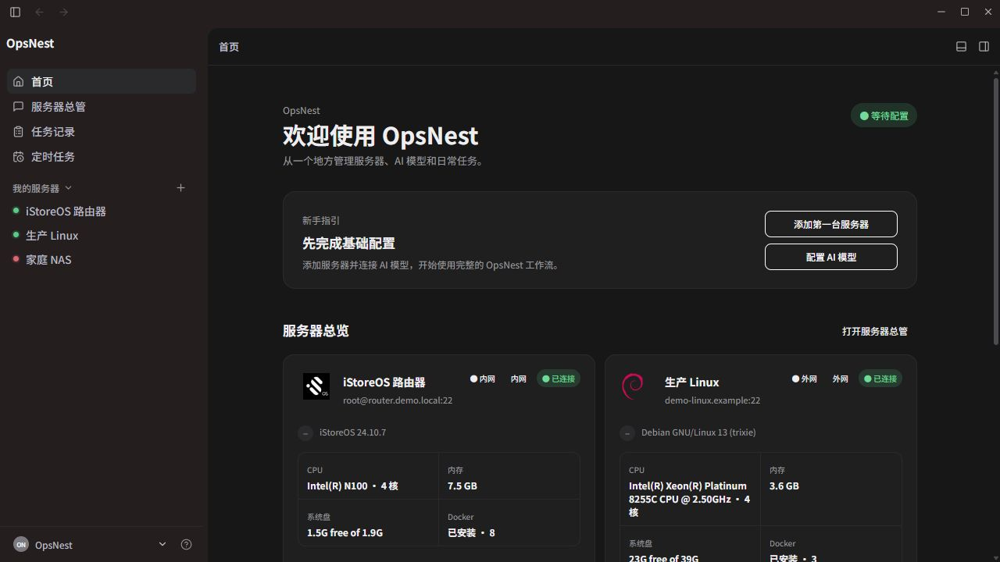
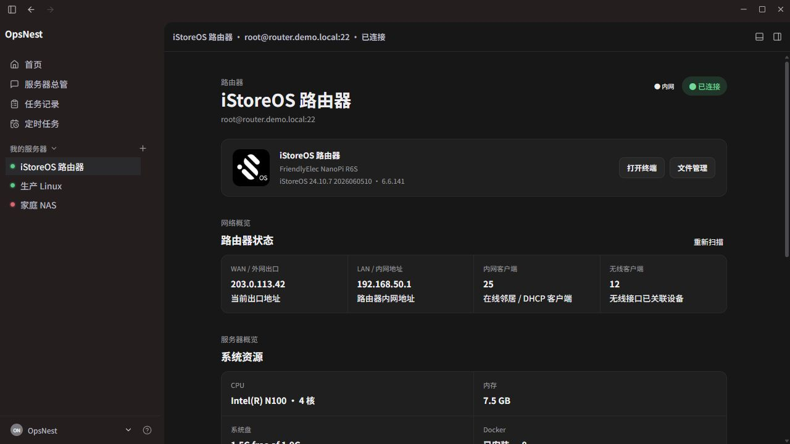
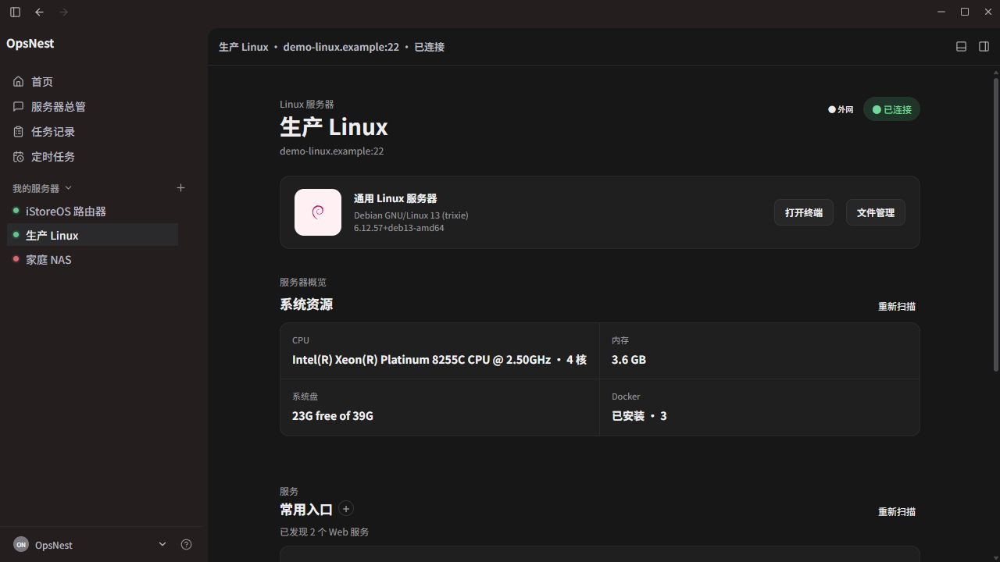
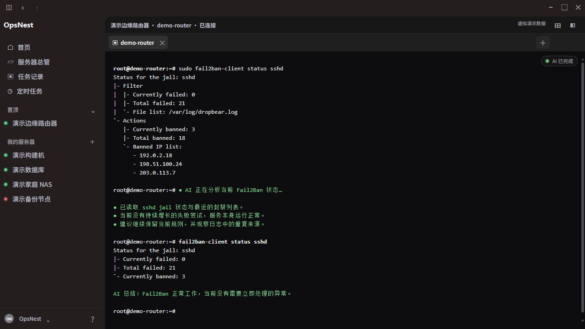
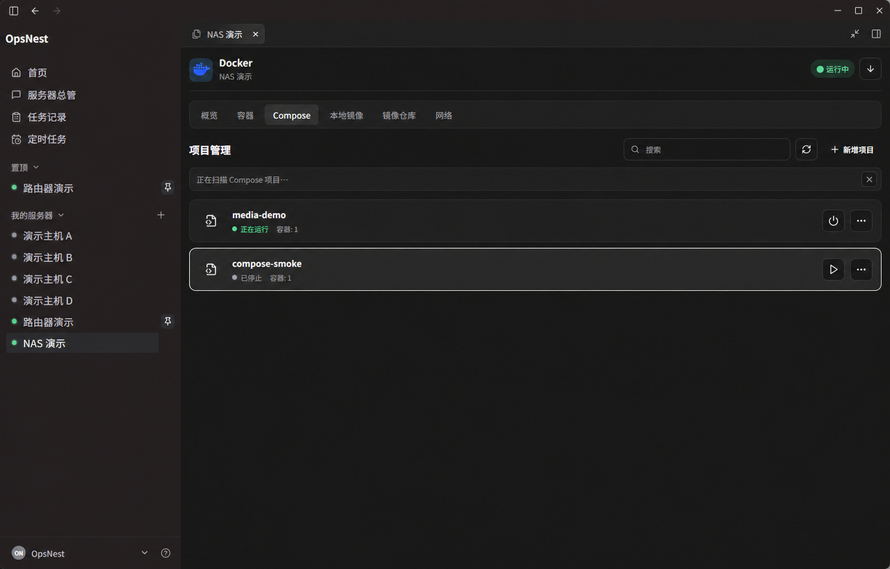

# OpsNest 运维小窝

简体中文 · [English](README.md)

## OpsNest 是款什么软件？

OpsNest，顾名思义，就是“运维小窝”。是一款集中管理您拥有的终端设备（服务器、路由器、NAS 等）的管理软件。

## 虚拟演示截图

以下截图使用虚构的演示服务器和地址，仅用于展示界面，不包含真实服务器信息。

## 核心功能

- 强大的 AI-SSH 功能：将 AI 与 SSH 终端结合。您不必记忆复杂的命令行，只需要用自然语言描述需求，AI 就会自动帮您完成工作。
- 集成的 AI 是真正的 Agent，可以帮您分析、执行并总结报告，而不是只提供建议的辅助型顾问。
- 界面保持 SSH 原生状态，还是熟悉的味道。

## 特色功能

1. **服务器大管家**：传统 AI 聊天界面，可以管理所有服务器。可以修改软件界面，帮助您增加或删除服务器连接，也可以执行其他 Agent 命令。
2. **特色首页**：每台终端连接的首页都会根据当前终端能力，自动识别为普通 Linux 服务器、OpenWrt 路由器或 NAS，并使用对应的版面设计。例如，路由器首页会显示连接数量等信息。
3. **服务发现**：自动扫描带有 Web 功能的端口，并将它们显示在快速打开卡片中。您可以一键打开服务，无需再记每个端口号，也可以添加自定义入口。

## SSH 终端使用技巧

终端会自动区分命令和自然语言，也会查询当前服务器 Shell 中的命令。无法确认时，可选择“作为命令执行”或“交给 AI”。需要明确指定时，在 Shell 提示符后使用以下前缀（不区分大小写）：

- `/CMD 原命令`：跳过 AI 分流，将原命令直接交给 SSH 终端。例如 `/CMD bash ./install.sh` 或 `/CMD cmehers chat`，适合菜单脚本、交互工具及新安装的程序。前缀由 OpsNest 处理，不会发送给服务器。
- `/AI 需求描述`：明确让 AI 处理，例如 `/AI 检查服务器磁盘空间`。

脚本进入菜单后，直接输入 `1`、`2` 等选项并按 Enter，无需再加 `/CMD`；密码提示下直接输入密码，字符不回显是正常现象。交互工具退出并回到 Shell 后，恢复命令与 AI 的自动分流。粘贴内容末尾的换行不会自动提交，需手动按 Enter。

如果 AI 误接管了原本要执行的命令，可停止 AI、等终端回到 Shell 提示符，再用 `/CMD 原命令` 重新运行；重新运行前请确认 AI 是否已经执行过，避免重复安装或修改。AI 也可在尚未调用任何工具时，将误接管的输入原文自动退回 `/CMD` 路径；明确使用 `/AI` 或选择“交给 AI”时不会自动退回。

`/CMD` 会直接运行命令，不经过 AI 命令审查。请确认命令来源和内容，尤其是安装脚本、删除及覆盖操作。

## 开发目标

- 更多类型的终端接入，更多特色产品专属主页接入
- 文件管理功能（目前已完成一版，功能较为简单）
- 文件在线编辑功能

## 特别感谢

- [CodexShell](https://github.com/HANSHOJIN/codex-shell)：提供 UI 界面外壳。
- [CodeMirror](https://codemirror.net/)（[源码仓库](https://github.com/codemirror/dev)）：提供文件编辑器核心，以及多种编程语言的语法支持模块。
- 内核及基础技术：感谢 [Tauri](https://tauri.app/)、[Rust](https://www.rust-lang.org/)、[React](https://react.dev/)、[TypeScript](https://www.typescriptlang.org/)、[Vite](https://vite.dev/)、[xterm.js](https://xtermjs.org/)、[russh](https://github.com/warp-tech/russh) 等开源项目和社区。

## 推荐免费 AI 部署软件

- [FreeLLMApi](https://github.com/tashfeenahmed/freellmapi)
